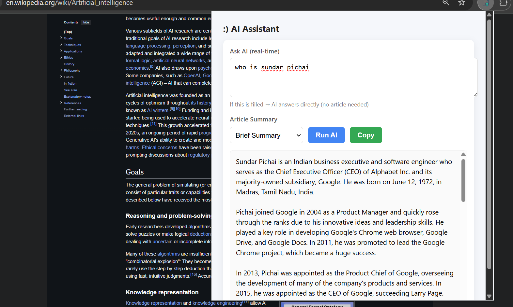
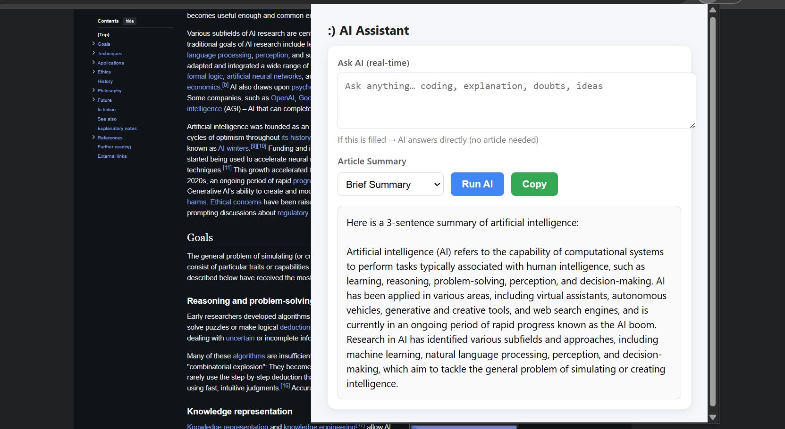

## 📸 Screenshots

### 🔹 AI Assistant Panel


### 🔹 Article Summary Result



---

````markdown
# 🧠 AI Chrome Extension – Article Summarizer & Assistant

An AI-powered Chrome Extension that helps users quickly understand long web articles by generating concise summaries and also acts as an AI assistant for contextual queries. Built to enhance productivity, improve reading efficiency, and provide instant intelligent support directly inside the browser.

---

## 🚀 Features
- 📄 Summarizes long-form articles into clear, short insights
- 🤖 Built-in AI Assistant for answering queries
- ⚡ Fast and easy-to-use interface
- 🧪 Optimized prompt workflows for better accuracy
- 🛠️ Built using **GORQ** and modern web tools

---

## 🛠️ Tech Stack
- JavaScript
- Chrome Extension APIs
- GORQ / AI Tools
- HTML, CSS

---

## 📥 Installation & Setup
1️⃣ Download or Clone the repository  
```bash
git clone https://github.com/YOUR_USERNAME/YOUR_REPO_NAME.git
````

2️⃣ Open **Chrome** → Go to

```
chrome://extensions/
```

3️⃣ Enable **Developer Mode**

4️⃣ Click **Load Unpacked**

5️⃣ Select your project folder

Done 🎉 Your AI Extension is now installed!

---


---

## 📂 Folder Structure

```
project
 ├─ assets/
 │   ├─ screenshot1.png
 │   └─ screenshot2.png
 ├─ manifest.json
 ├─ popup.html
 ├─ popup.js
 ├─ styles.css
 └─ README.md
```

---

## 🤝 Contributions

Feel free to fork, improve, and submit a PR.

---

## 📜 License

This project is for learning and development purposes.

---

## 👤 Author

**Koushik Shet**

```

---


```
